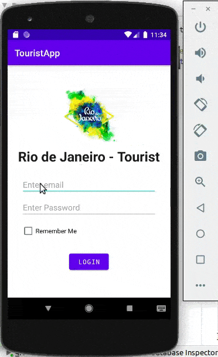

# Tourist APP - Rio de Janeiro

<span style="display:block;text-align:center"></span>

# How to run

Clone the project

```

- Clone this repo:
    https://github.com/mascarenhaswanja/TourismApp.git

- Open in Android Studio:
    TourismApp project

    Choose your device - emulator

    Run the project
```

# :books: Technologies and Resources

1. [Android Studio](https://developer.android.com/docs) - Documentation app developers

2. Java

3. XML

4. Intents - Data between screens

5. Persisted data- with **JSON**(List of Tourist Attractions and Rating by user attraction
   [Rating Bar - JSON](https://medium.com/@naimishverma50/android-writing-a-file-as-a-json-object-400131f6063b)

6. Shared Preferences - Email and Password
   [Shared Preferences](https://www.youtube.com/watch?v=jiD2fxn8iKA) - store simple key-value data into your Android app.

# App Description

The app select some tourist points in Rio de Janeiro.

## Login

Provide a screen that would allow users to login with a email and password. Valid usernames and passwords are provided. Remember Me **CheckBox** - If the user has this checked, they will be automatically logged in and navigated to the Tourist Attraction List.

## Valid Email and Password:

thanos@gmail.com - 1234

wonderwoman@yahoo.com - abc!!

## Attraction List

After logging in, the app must display a list of popular tourist attractions in the city. Display the attraction name, address, and a photo. The data for list of attractions loaded from a JSON file that is stored in the assets/folder. Implemented using List View and Adapter.

## Attraction Detail

Display a screen that shows more detailed information about the attraction (name, address, phone no, website, two photos, description and pricing).

- :phone: Clicking on the attraction’s phone number will automatically open the phone dialer so the user can attempt to call said place.
- :computer: Clicking on the website will automatically open a browser displaying the website
- :star: Rating Bar where the user can rate the attraction. The user’s rating for an attraction should be saved to a json file.

The screen should also contain a Rating Bar where the user can rate the attraction. The user’s rating for an attraction should be saved to a json file.

## Buttons

Login, Go Back and Logout
